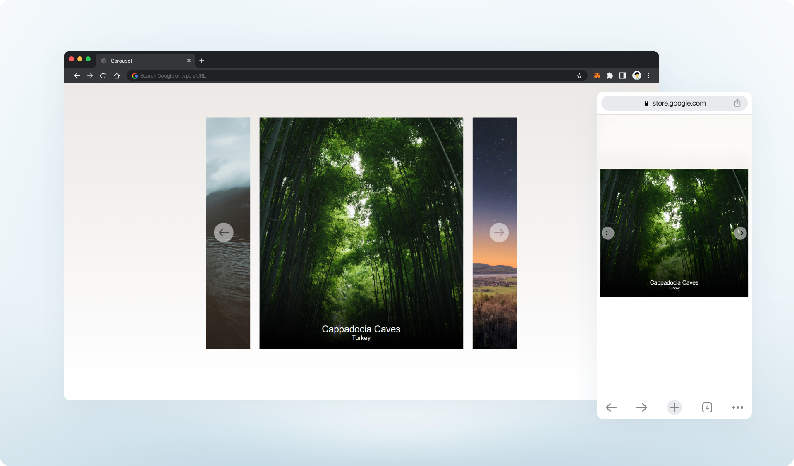

# Responsive Carousel of famous places
## 
This project is a responsive image carousel built with Swiper.js, featuring custom navigation buttons and an elegant card design.

### Key Features
- Responsive Slides Per View: Automatically adjusts the number of visible slides based on screen size, making it mobile-friendly.
- Autoplay: Smooth automatic transitions with configurable delays, which will be disabled after user interaction, requiring manual navigation to continue.
- Custom Navigation Buttons: Includes custom-designed next and previous buttons for seamless manual navigation.
- Keyboard Control: Allows users to navigate slides using keyboard arrows for improved accessibility.
- Lazy Loading: Optimized to load images only when needed, enhancing performance. 

### Tech Stack
- HTML & CSS for layout and styling
- JavaScript for Swiper.js configuration

💼 Contact me on linkedin. [Linkedin](https://www.linkedin.com/in/adityamamta/)  
adityamamta4@gmail.com

